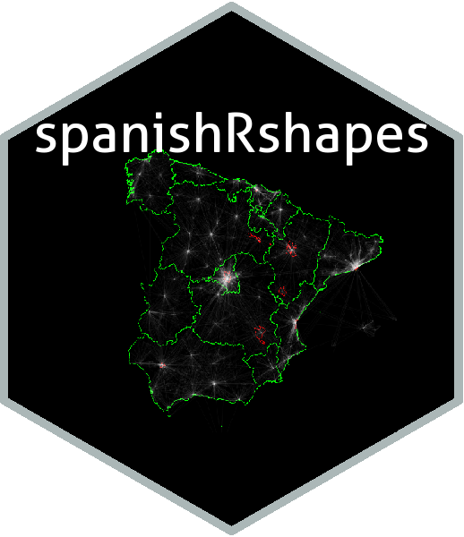

------------------------------------------------------------------------

------------------------------------------------------------------------

------------------------------------------------------------------------

  

------------------------------------------------------------------------

<!-- README.md is generated from README.Rmd. Please edit that file -->
spanishRshapes 
================================================================================

The goal of spanishRshapes is: facilitar el uso de datos de limites territoriales españoles en R. Contiene ficheros de datos para los lindes de: CC.AA. provincias y municipios. Los datos proviene del del [Instituto Geográfico Nacional](http://www.ign.es/web/ign/portal), concretamente del [centro de descargas](http://centrodedescargas.cnig.es/CentroDescargas/index.jsp). Una vez en el centro de descargas, hay que ir a `Información geográfica de referencia` y luego a `Lineas límite municipales`

Conuntos de datos
=================

`spanishRshapes` es un package de datos. Concretamente contiene los siguientes conjuntos de datos:

-   **IGN\_CCAA\_17**: lindes/polígonos/shapes de las 17 CC.AA españolas (+ Ceuta y Melilal). \[19 rows y 11 variables\]

-   **IGN\_prov\_17**: lindes/polígonos/shapes de las provincias españolas (52 rows and 13 variables)

-   **IGN\_mun\_17**: lindes/polígonos/shapes de los municipios españoles (8211 rows and 20 variables). \[8.124 municipios, 81 condominios, 6 islitas alrededor de la Gomera\]

Formato de datos
================

Los datos estan en spatial-df. Se abren con el paquete `sf`
